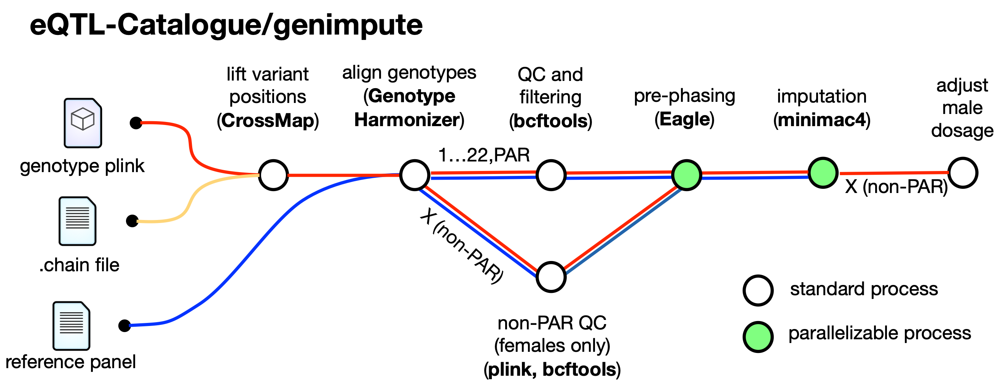

# eQTL-Catalogue/genimpute workflow

Genotype imputation and quality control workflow used by the eQTL Catalogue. 




Performs the following main steps:

**Pre-imputation QC:**
- Convert raw array genotypes to GRCh38 coordinates with [CrossMap.py](http://crossmap.sourceforge.net/) v0.4.1
- Align array genotypes to the [1000 Genomes 30x on GRCh38](https://www.internationalgenome.org/data-portal/data-collection/30x-grch38) reference panel with [Genotype Harmonizer](https://github.com/molgenis/systemsgenetics/wiki/Genotype-Harmonizer).
- Convert the genotypes to the VCF format with [PLINK](https://www.cog-genomics.org/plink/1.9/). 
- Exclude variants with Hardy-Weinberg p-value < 1e-6, missingness > 0.05 and minor allele frequency < 0.01 with [bcftools](https://samtools.github.io/bcftools/)
- Calculate individual-level missingness using [vcftools](https://vcftools.github.io/perl_module.html).

**Imputation:**
- Genotype pre-phasing with Egale 2.4.1 
- Genotype imputation with Minimac4

**Post-imputation QC:**
- Exclude variants with imputation R2 < 0.4
- Keep variants on chromosomes 1-22 and X
- Keep variants with MAF > 0.01
- Multiply genotype dosage of male samples on the Non-PAR region of the X chromsome by two for easier QTL mapping

## Input parameters

**--bfile**

Raw genotypes in PLINK format (bed, bim, fam). Assumed to be in GRCh37 coordinates.  Genotypes in VCF format can be converted to PLINK format with:

```bash
plink --vcf <path_to_vcf_file> --make-bed --out <plink_file_prefix>
```

The PAR and non-PAR regions of the X chromosome should be merged together and the name of the X chromsome should be 'X'. This can be achieved with PLINK:
```bash
plink --bfile Young_2019 --merge-x --make-bed --output-chr MT --out Young_2019_mergedX
```
  

## Example command

Imputing genotypes from the open access CEDAR dataset.

```
nextflow run main.nf \
  -profile eqtl_catalogue -resume\
  --bfile plink_genimpute/CEDAR\
  --output_name CEDAR\
  --outdir CEDAR\
  --impute_PAR true\
  --impute_non_PAR true
```

## Contributors
* Ralf Tambets
* Kaur Alasoo
* Liina Anette Pärtel
* Mark-Erik Kodar
